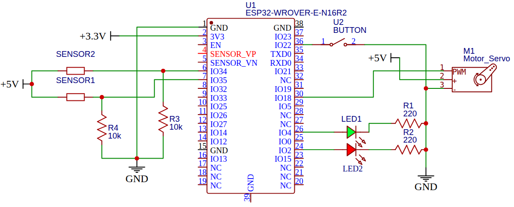

# SOFT GRIPPER FOR ADAPTIVE GRASPING

This project was developed for the COMP0243: Introduction to Soft Robotics course of the University College London, Robotics & Artificial Intelligence MSc. 

## Project BoM:
- ESP32 developer board
- MG996R Servo Motor
- ZD10-100 sensor x 2
- TPU filament

##  Project Description

Soft grippers enable safe, adaptable manipulation of objects with uncertain shape. Industrial deployment still faces challenges in manufacturability, reliable feedback, and calibration stability.  

The focus of this project is to develop a soft gripper
capable of grasping objects with varying sizes, weights, and
shapes. It should be easily manufacturable using the widely
commercially available FDM technology and TPU material,
with minimal supports and no multi-material. This ensures
reproducibility without the need of complex machines or
manufacturing processes. Finally, the print should require
minimal post-processing.

## Contents

- Final Report Submitted
- ESP32 code 
- Presentation
- Data compiled and plotting scripts

## Circuit Diagram
